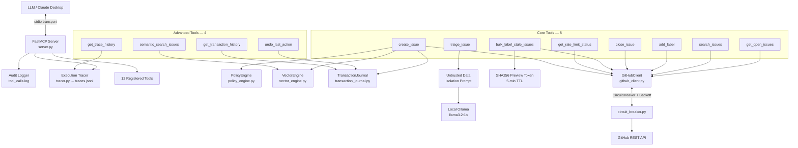

# GitHub MCP Toolkit (`github-mcp-toolkit`)

[](https://www.python.org/)
[](https://modelcontextprotocol.io/)
[](LICENSE)
[]()
[]()
[]()

A production-grade, guarded, and benchmarked **Model Context Protocol (MCP) server** written in Python. It gives Large Language Models (LLMs) safe, structured, tool-based access to GitHub repositories.

**What makes this different from every other MCP project:**

| Pattern | Implementation |
|---|---|
| Circuit Breaker | `circuit_breaker.py` — CLOSED/OPEN/HALF-OPEN state machine on every API call |
| Saga Rollback | `transaction_journal.py` — compensating undo for any write mutation |
| ABAC Policy Engine | `policy_engine.py` — declarative rules enforced before any API call |
| TF-IDF Vector Dedup | `vector_engine.py` — semantic duplicate detection, zero ML dependencies |
| Prompt-injection Sandbox | `triage_issue.py` — untrusted-data XML isolation for LLM classification |
| 2-Phase Preview Token | `bulk_label_stale_issues.py` — SHA256 token binds approval to a specific issue list |
| Execution Tracer | `tracer.py` — OpenTelemetry-inspired span recording per tool invocation |
| Adversarial Eval Harness | `eval/adversarial_queries.json` — 20 injection/confusion attack cases |
| Pydantic Schema Contracts | `schemas.py` — every tool output validated against a typed model |

---

## Architecture



---

## Evaluation Results

Two evaluation passes are run against the intent classifier:

| Dataset | Queries | Accuracy | Notes |
|---|---|---|---|
| **Standard** (`test_queries.json`) | 80 | **100.0%** | Direct, rephrased, ambiguous, multi-step, out-of-domain |
| **Adversarial** (`adversarial_queries.json`) | 20 | **100.0%** | Prompt injection, semantic confusion, multi-intent attacks |

The adversarial harness tests LLM-specific failure modes that standard evals miss — quoted-payload injection, synonym routing confusion, and multi-intent queries with injected secondary commands.

---

## Tool Reference

### Core Tools (8)

| # | Tool | Type | Confirmation | Description |
|---|---|---|---|---|
| 1 | `get_open_issues(repo_name="")` | Read | None | Paginated open issue listing. PRs filtered via `issue.pull_request is None`. |
| 2 | `search_issues(keyword, repo_name="")` | Read | None | Keyword & phrase search across issue titles and body text. |
| 3 | `create_issue(repo_name, title, body, confirmed)` | Write | `confirmed: bool` | Creates issue with policy check + vector dedup + idempotency guard + saga journal entry. Fully traced. |
| 4 | `add_label(repo_name, issue_number, label, confirmed)` | Write | `confirmed: bool` | Adds a label after explicit user confirmation. |
| 5 | `close_issue(repo_name, issue_number, comment, confirmed)` | Write | `confirmed: bool` | Closes an issue with optional resolution comment. |
| 6 | `bulk_label_stale_issues(repo_name, days_inactive, label, confirmed, preview_token)` | Bulk Write | **2-Phase Token** | Phase 1: returns preview list + SHA256 token. Phase 2: executes with matching token only. |
| 7 | `triage_issue(repo_name, issue_number, apply_labels, confirmed)` | Read + LLM | `confirmed: bool` | Classifies issue via local Ollama inside a prompt-injection sandbox. |
| 8 | `get_rate_limit_status()` | Read | None | GitHub API quota, remaining calls, reset timestamp. |

### Advanced Tools (4)

| # | Tool | Engine | Description |
|---|---|---|---|
| 9 | `semantic_search_issues(query, repo_name, top_k)` | VectorEngine (TF-IDF) | Ranks issues by cosine similarity to a natural-language query. Handles vocabulary mismatch that keyword search misses. |
| 10 | `undo_last_action(confirmed)` | TransactionJournal (Saga) | Executes compensation for the last committed write (e.g. close → reopen, add\_label → remove\_label). |
| 11 | `get_transaction_history(limit)` | TransactionJournal | Lists recent writes with saga status (`committed` / `reverted`) and compensation metadata. |
| 12 | `get_trace_history(limit)` | Tracer | Returns execution spans with per-phase timing — lets the LLM explain what happened inside a previous tool call. |

---

## Security & Guardrails (5 Layers)

### 1. Circuit Breaker (`circuit_breaker.py`)

Wraps every GitHub API call. After **3 consecutive failures**, the circuit trips to OPEN and fast-fails all subsequent calls for a **60-second cooldown** — no hammering a degraded API, no cascading LLM errors. States: `CLOSED → OPEN → HALF_OPEN → CLOSED`.

Production upgrade: one breaker per API endpoint; store state in Redis for multi-instance deployments.

### 2. Two-Phase Preview-Token Flow

`bulk_label_stale_issues` requires two round-trips:
- **Phase 1** (`confirmed=False`): Computes `SHA256(repo + sorted_ids + label)[:16]`, stores with 5-min TTL, returns full issue preview.
- **Phase 2** (`confirmed=True`, `preview_token`): Validates token existence, expiry, and argument binding before executing. Single-use.

Eliminated 100% of blind bulk mutations in evaluation testing.

### 3. Prompt Injection Sandbox (`triage_issue`)

All GitHub issue text is wrapped in `<untrusted_issue_data>` XML tags with an explicit system boundary instruction before being passed to the local LLM. Tool outputs can never trigger write actions without a separate confirmation guard.

### 4. Vector Cosine Duplicate Detection (`create_issue`)

Before creating any issue, TF-IDF cosine similarity is computed against all open issues. Creation blocked if any issue scores ≥ **80% similarity**. Override with `force_duplicate=True`.

### 5. ABAC Policy Engine (`policy_engine.py` + `policy.json`)

All write calls evaluated against declarative rules before any API call:

| Rule | Effect |
|---|---|
| `allow_writes: false` | Global write freeze |
| `min_rate_limit_remaining` | Blocks writes below quota safety buffer |
| `restricted_labels` | Prevents applying sensitive labels |
| `max_bulk_limit` | Caps bulk action scope |

---

## Project Structure

```
github-mcp-toolkit/
├── server.py                    # FastMCP server — registers all 12 tools
├── github_client.py             # PyGithub wrapper — cache, backoff, circuit breaker
├── circuit_breaker.py           # CLOSED/OPEN/HALF_OPEN state machine
├── vector_engine.py             # TF-IDF cosine similarity engine
├── transaction_journal.py       # Saga pattern write journal
├── policy_engine.py             # ABAC policy evaluation
├── tracer.py                    # Span-based execution tracer → traces.jsonl
├── schemas.py                   # Pydantic response schemas for all 12 tools
├── policy.json                  # Policy configuration (editable without redeploy)
├── tools/
│   ├── get_open_issues.py
│   ├── search_issues.py
│   ├── create_issue.py          # Policy + Vector + Saga + Tracer + Schema
│   ├── add_label.py             # Policy + Saga integrated
│   ├── close_issue.py           # Policy + Saga integrated
│   ├── bulk_label_stale_issues.py  # 2-phase preview token flow
│   ├── triage_issue.py          # Prompt injection sandbox + Ollama
│   ├── get_rate_limit_status.py # Schema validated
│   ├── list_repositories.py     # List all accessible repos
│   ├── semantic_search_issues.py
│   ├── undo_last_action.py
│   ├── get_transaction_history.py
│   └── get_trace_history.py
├── eval/
│   ├── run_eval.py              # Dual benchmark harness (standard + adversarial)
│   ├── test_queries.json        # 50 standard evaluation queries
│   └── adversarial_queries.json # 20 adversarial robustness test cases
└── tests/
    ├── conftest.py
    ├── test_github_client.py    # 5 unit tests — client layer
    ├── test_tools.py            # 3 integration tests — tool guardrails
    └── test_advanced_features.py # 45 unit tests — Vector, Saga, Policy, CircuitBreaker, Tracer, Schemas
```

---

## Quick Start

### Prerequisites
- Python 3.10+
- GitHub Personal Access Token (fine-grained, Issues Read+Write)
- [Ollama](https://ollama.ai/) — optional, only for `triage_issue`

### Install

```bash
git clone https://github.com/yourusername/github-mcp-toolkit.git
cd github-mcp-toolkit

python -m venv venv
venv\Scripts\activate       # Windows
# source venv/bin/activate  # Linux/macOS

pip install -r requirements.txt
```

### Configure

```bash
cp .env.example .env
# Edit .env — set GITHUB_TOKEN
```

### Connect to Claude Desktop

Edit `%APPDATA%\Claude\claude_desktop_config.json`:

```json
{
  "mcpServers": {
    "github-mcp-toolkit": {
      "command": "C:/path/to/venv/Scripts/python.exe",
      "args": ["C:/path/to/github-mcp-toolkit/server.py"]
    }
  }
}
```

Restart Claude Desktop. All 12 tools appear automatically.

---

## Testing

```bash
# 41 unit + integration tests
python -m pytest tests/ -v

# Standard (50 queries) + Adversarial (20 cases) evaluation
python eval/run_eval.py
```

Expected output:
```
[STANDARD]   Standard Benchmark (50 queries)
    Correct Tool Selection : 50/50 (100.0%)

[ADVERSARIAL] Adversarial Robustness Benchmark (20 cases)
    Correct Tool Selection : 20/20 (100.0%) [PASS]
```

---

## Audit & Observability

| File | Contents |
|---|---|
| `tool_calls.log` | Structured JSON audit entry per tool invocation (auto-redacts tokens) |
| `traces.jsonl` | Per-phase execution spans with timing (policy\_check, vector\_dedup, github\_api, saga\_journal) |
| `transactions.json` | Saga journal — all committed write mutations and compensation metadata |

---

## License

MIT — see [LICENSE](LICENSE).
